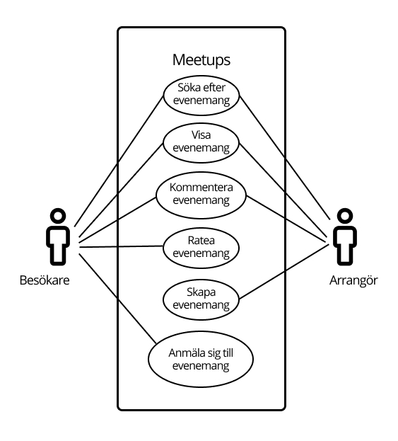

# User Stories

## Besökare

- Som besökare vill jag se de närmast kommande meetups för att jag är spontan av mig.
- Som besökare vill jag kunna se hur många som har anmält sig till en meetup för att jag vill veta hur populärt det är.
- Som besökare vill jag se vart någonstans en meetup ska hålla rum för att kunna hitta rätt.
- Som besökare vill jag se gamla meetups för att se vilka meetups som kan tänkas ske i framtiden.
- Som besökare vill jag att gamla meetups ska vara tydligt markerade för att slippa försöka anmäla mig till dem.
- Som besökare vill jag se en rating på gamla meetups för att se vad folk tyckte om dessa.
- Som besökare vill jag kunna ratea en meetup som jag varit på för att hjälpa andra besökare hitta rätt meetup i framtiden.
- Som besökare vill jag kunna kommentera på en meetup för att dela med mig av mina tankar
- Som besökare vill jag kunna söka på meetups teman för att snabbt kunna hitta det som intresserar mig
- Som besökare vill jag kunna söka på en meetups titel för att hitta en meetup jag blivit tipsad om

## Arrangör

- Som arrangör vill jag kunna skapa en meetup för att engagera folk inom det jag tycker är kul
- Som arrangör vill jag kunna begränsa antalet platser på min meetup för att jag inte har plats för så många personer
- Som arrangör vill jag kunna bestämma en tid och plats för min meetup så att folk kan planera
- Som arrangör vill jag kunna lägga till en beskrivning på min meetup för att folk ska förstå vad den handlar om
- Som arrangör vill jag kunna välja teman som passar in på min meetup för att folk ska kunna hitta det lätt

# UML use case-diagram

